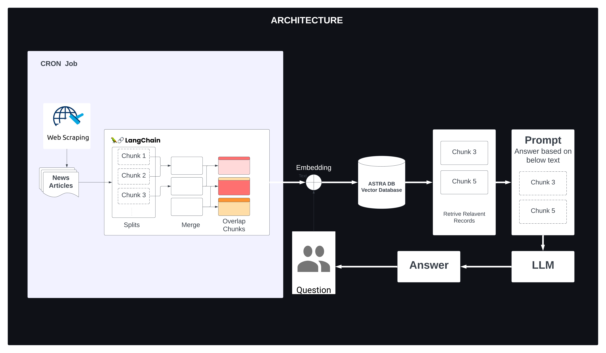

# FinSight: Your Financial News Companion! 🚀

## Project Overview

FinSight is a powerful tool designed for the analysis of financial news headlines. With real-time news analysis and an interactive user interface, FinSight aims to provide valuable insights into the dynamic world of finance.

One of the key features that sets FinSight apart is its utilization of advanced natural language processing. FinSight leverages the Large Language Model (LLM) from OpenAI API to fetch answers to questions posed about financial articles. This enables users to gain deeper insights into the content of news articles by extracting relevant information directly.

## Features

- **Real-time Financial News Analysis**: Stay updated with the latest financial news as it happens.
- **Interactive User Interface**: A user-friendly interface for seamless navigation and exploration of financial headlines.

## System Design

FinSight leverages the following technologies and components:

- **LangChain**: Utilizes LangChain for processing URLs, extracting information, and dividing articles into chunks.
- **OpenAI API (LLM)**: Leverages the Large Language Model (LLM) from OpenAI API for asking questions to articles and generating relevant answers.
- **Vector Database (ASTRA DB)**: Stores embeddings of chunks for efficient retrieval and analysis.
- **Streamlit UI**: Presents financial news and analysis through an interactive and visually appealing Streamlit user interface.



## Getting Started

### Prerequisites

- Python 3.6+
- Install required dependencies by running:
  ```bash
  pip install -r requirements.txt
